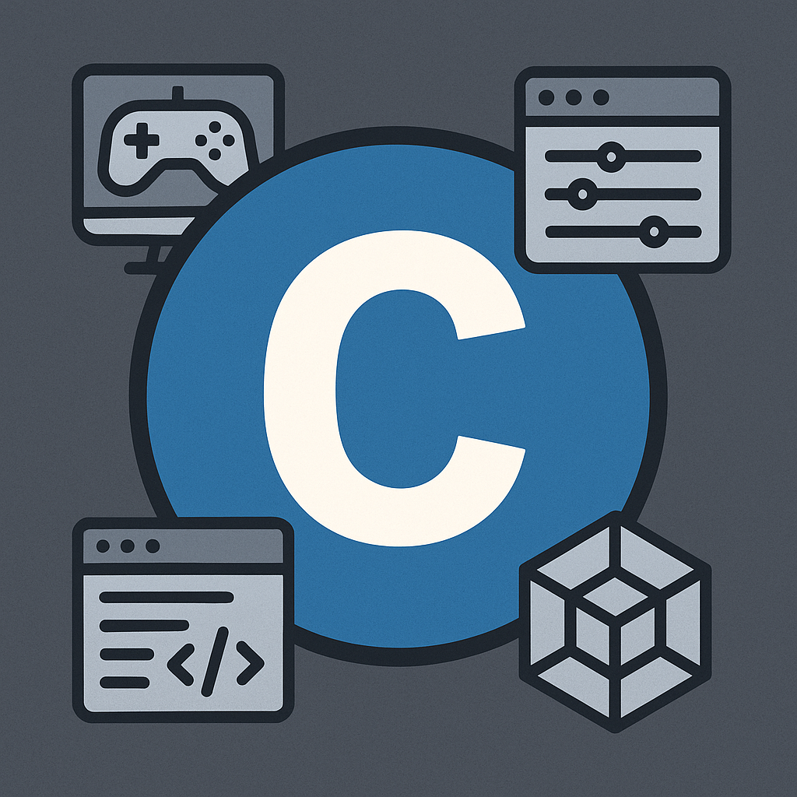

<p align="center">
  
</p>

<p align="center">
  <a href="https://github.com/dunamismax/c-raylib">
    
  </a>
</p>

<p align="center">
  <a href="https://clang.llvm.org/"></a>
  <a href="https://www.raylib.com/"></a>
  <a href="https://developer.apple.com/documentation/apple-silicon"></a>
  <a href="https://opensource.org/licenses/MIT"></a>
  <a href="https://github.com/dunamismax/c-raylib/pulls"></a>
  <a href="https://github.com/dunamismax/c-raylib/stargazers"></a>
</p>

---

## About This Project

A **complete C gaming monorepo** built with raylib for developing multiple 2D pixel art games. This scalable architecture demonstrates professional game development practices with shared libraries, optimized build systems, and a fully playable Flappy Bird clone called "FOSS Flapper".

**Key Features:**

- **Pure C Implementation**: Modern C11 with raylib for cross-platform 2D game development
- **Monorepo Architecture**: Scalable structure supporting multiple games with shared libraries
- **FOSS Flapper Demo**: Complete Flappy Bird clone with physics, scoring, and game states
- **Shared Libraries**: Reusable animation system and game utilities in `corelib`
- **Auto-Discovery Build**: Intelligent Makefile automatically detects new games and libraries
- **ARM64 Optimized**: Apple Silicon-specific optimizations with advanced compiler flags
- **Cross-Platform**: Support for macOS, Linux, and Windows with proper platform detection
- **Professional Structure**: Clean separation of games, libraries, assets, and dependencies
- **Memory Safe**: Secure coding practices with bounds checking and proper cleanup
- **60 FPS Performance**: Optimized for smooth real-time game rendering

---

## Quick Start

### Prerequisites

**Required Dependencies:**

```bash
# macOS (Primary Platform)
xcode-select --install

# Ubuntu/Debian
sudo apt-get install build-essential clang make git

# Fedora/RHEL
sudo dnf install clang make git

# Arch Linux
sudo pacman -S base-devel clang make git

# Optional development tools
brew install clang-format llvm    # macOS
```

### Installation & Setup

```bash
# Clone repository with submodules
git clone --recurse-submodules https://github.com/dunamismax/c-raylib.git
cd c-raylib

# Build everything
make                          # Release mode (default)
make MODE=debug              # Debug with sanitizers
make MODE=profile            # Profile build

# Verify installation
make help                    # Show all available targets
```

### Start Playing

```bash
# Build and run FOSS Flapper
make run-foss_flapper

# Or build first, then run
make
./build/foss_flapper

# Game will open in a 512x768 window
# Click mouse or press SPACE to play!
```

### First Time Usage

```bash
# Build the demo game
make foss-flapper

# Run the game
./build/foss_flapper

# Game controls:
# - Mouse click or SPACE: Make bird flap
# - Any key after game over: Restart
```

---

## Usage Guide

### Game Development

```bash
# Create new game structure
mkdir -p games/your_game/src
mkdir -p assets/your_game/{audio,textures}
ln -s ../../assets/your_game games/your_game/assets

# Build system auto-detects new games
make                         # Builds all games including new ones
make your_game              # Build specific game
make run-your_game          # Build and run specific game
```

### Shared Libraries

```bash
# Current libraries
libs/corelib/               # Animation system and common utilities

# Use in your game
#include "corelib.h"        # Animation functions
// Link automatically handled by Makefile
```

### Asset Management

```bash
assets/
├── foss_flapper/          # FOSS Flapper assets
│   ├── audio/            # Sound effects and music
│   └── textures/         # Sprites and images
└── your_game/            # Your game assets
    ├── audio/
    └── textures/

# Assets linked to games via symlinks
# games/foss_flapper/assets -> ../../assets/foss_flapper
```

---

## Build System

Cross-platform Makefile with ARM64 optimization and game-specific features.

### Core Commands

```bash
# Building
make                       # Build everything (raylib + libs + games)
make raylib               # Build raylib only
make libs                 # Build shared libraries
make games                # Build all games
make clean                # Clean build artifacts

# Individual games
make foss-flapper         # Build FOSS Flapper
make run-foss_flapper     # Build and run FOSS Flapper

# Development
make MODE=debug           # Debug build with sanitizers
make help                 # Show all available targets
```

### Optimization Features

- **Apple Silicon**: ARM64-specific optimizations for M-series processors (`-mcpu=apple-m1`)
- **Link-Time Optimization**: Smaller, faster binaries in release builds (`-flto`)
- **Parallel Builds**: Automatically uses all CPU cores
- **Cross-Platform**: Adapts flags for macOS, Linux, and Windows
- **Game-Specific**: Optimized compiler flags for 60 FPS gaming performance

---

## Gaming Architecture

### FOSS Flapper Game

**Complete Flappy Bird Clone:**

- **Game States**: Ready screen, playing mode, and game over screen
- **Physics System**: Gravity-based bird movement with jump mechanics
- **Procedural Generation**: Infinite scrolling pipes with randomized vertical gaps
- **Collision Detection**: Optimized circle-to-rectangle collision system
- **Scoring System**: Real-time score tracking with high score persistence
- **Responsive Controls**: Mouse click or spacebar input handling

**Technical Features:**

- 60 FPS smooth gameplay with delta time calculations
- Efficient sprite rendering with raylib's texture system
- State machine for clean game flow management
- Memory-safe collision detection and game object management

### Core Library (corelib)

**Animation System:**

```c
// Create sprite animation from frames
Animation CreateAnimation(Texture2D spritesheet, Rectangle* frames,
                         int frameCount, float frameDuration, bool loop);

// Update animation timing
void UpdateAnimation(Animation* anim, float deltaTime);

// Render current frame
void DrawAnimation(Animation anim, Vector2 position, float rotation);
```

**Game Utilities:**

- Spritesheet-based animation system
- Frame timing and looping control
- Rotation and positioning support
- Memory management for animation data

### Asset Pipeline

**Directory Structure:**

```bash
assets/game_name/
├── audio/                # Sound effects, music (WAV, OGG)
├── textures/            # Sprites, backgrounds (PNG, JPG)
└── fonts/               # Custom fonts (TTF)
```

**Asset Loading:**

- Automatic texture loading with raylib
- Efficient memory management
- Hot-reloading support in debug builds
- Cross-platform asset path handling

---

## Testing & Quality

### Game Testing

```bash
make MODE=debug           # Debug build with memory sanitizers
make run-foss_flapper     # Test gameplay functionality
```

**Test Coverage:**

- Game state transitions and logic
- Physics calculations and collision detection
- Animation system performance
- Memory safety with AddressSanitizer
- Cross-platform compatibility

### Performance Optimization

**Tools:**

- **clang-tidy**: Static analysis for game code
- **AddressSanitizer**: Runtime memory error detection
- **Frame timing**: Built-in FPS monitoring
- **Memory profiling**: Leak detection and optimization

**Standards:**

- C11 standard with raylib integration
- 60 FPS target with vsync support
- Memory-efficient sprite management
- Optimized collision detection algorithms

---

## Project Structure

```sh
c-raylib/
├── games/                    # Individual game projects
│   └── foss_flapper/
│       ├── src/
│       │   └── main.c       # Complete Flappy Bird implementation
│       └── assets/          # Symlink to ../../assets/foss_flapper
├── libs/                     # Shared game libraries
│   └── corelib/
│       ├── include/
│       │   └── corelib.h    # Animation system declarations
│       └── src/
│           └── corelib.c    # Animation system implementation
├── assets/                   # Centralized game assets
│   └── foss_flapper/
│       ├── audio/           # Sound effects and music
│       └── textures/        # Sprites and images
├── vendor/                   # Third-party dependencies
│   └── raylib/              # Raylib submodule
├── build/                    # Build artifacts (auto-generated)
│   ├── libraylib.a          # Compiled raylib library
│   ├── libcorelib.a         # Compiled shared libraries
│   └── foss_flapper         # Game executables
└── Makefile                 # Cross-platform build system
```

### Technology Stack

- **Language**: C11 with ARM64-specific optimizations
- **Graphics**: Raylib for 2D rendering, audio, and input handling
- **Build System**: Cross-platform Makefile with intelligent dependency detection
- **Architecture**: Monorepo with shared libraries and auto-discovery
- **Compiler**: Clang with game-specific optimization flags
- **Platforms**: macOS, Linux, Windows (cross-compilation ready)

---

## Game Development Guide

### Creating New Games

**1. Setup Game Structure:**

```bash
# Create game directory
mkdir -p games/your_game/src
mkdir -p assets/your_game/{audio,textures}

# Create asset symlink
ln -s ../../assets/your_game games/your_game/assets
```

**2. Basic Game Template:**

```c
#include "raylib.h"
#include "corelib.h"

int main(void) {
    InitWindow(800, 600, "Your Game");
    SetTargetFPS(60);

    while (!WindowShouldClose()) {
        // Update game logic

        BeginDrawing();
        ClearBackground(RAYWHITE);

        // Draw game objects

        EndDrawing();
    }

    CloseWindow();
    return 0;
}
```

**3. Build and Run:**

```bash
make                    # Auto-detects new game
make run-your_game     # Build and run
```

### Using Shared Libraries

**Animation System:**

```c
// Load spritesheet
Texture2D spritesheet = LoadTexture("assets/player.png");

// Define animation frames
Rectangle frames[] = {
    {0, 0, 32, 32},      // Frame 1
    {32, 0, 32, 32},     // Frame 2
    {64, 0, 32, 32}      // Frame 3
};

// Create animation
Animation playerAnim = CreateAnimation(spritesheet, frames, 3, 0.1f, true);

// In game loop
UpdateAnimation(&playerAnim, GetFrameTime());
DrawAnimation(playerAnim, playerPosition, 0.0f);
```

---

## Troubleshooting

### Common Issues

**Build Problems:**

```bash
# Clean rebuild
make clean && make

# Check raylib submodule
git submodule update --init --recursive

# Verify clang installation
clang --version
```

**Game Issues:**

```bash
# Check assets directory
ls -la games/foss_flapper/assets/

# Verify symlink
ls -la games/foss_flapper/assets

# Test basic build
make raylib && make libs && make games
```

**Performance Problems:**

```bash
# Use release mode
make MODE=release

# Check FPS
# Built-in FPS counter in debug builds

# Profile build
make MODE=profile
```

### Platform-Specific Notes

**macOS:**

- Requires Xcode Command Line Tools
- Uses Apple-specific optimization flags
- Supports Metal rendering backend

**Linux:**

- Requires OpenGL development libraries
- Uses X11 for window management
- Supports Wayland in newer raylib versions

**Windows:**

- MinGW or MSVC compiler support
- Direct3D rendering backend available
- Cross-compilation from Unix systems

---

## Contributing

Contributions welcome! Focus on adding new games, improving shared libraries, or enhancing the build system.

### Development Workflow

```bash
# Setup development environment
git clone --recurse-submodules https://github.com/dunamismax/c-raylib.git
cd c-raylib
make MODE=debug

# Before submitting PR
make clean && make
# Test your changes thoroughly
```

### Adding New Games

1. Create game directory structure
2. Implement game using raylib and corelib
3. Add assets with proper organization
4. Test across platforms
5. Update documentation

---

## Support This Project

If you find this C Gaming Monorepo valuable for your game development needs, consider supporting its continued development:

<p align="center">
  <a href="https://www.buymeacoffee.com/dunamismax" target="_blank">
    
  </a>
</p>

---

## Connect

<p align="center">
  <a href="https://twitter.com/dunamismax" target="_blank"></a>
  <a href="https://bsky.app/profile/dunamismax.bsky.social" target="_blank"></a>
  <a href="https://reddit.com/user/dunamismax" target="_blank"></a>
  <a href="https://discord.com/users/dunamismax" target="_blank"></a>
  <a href="https://signal.me/#p/+dunamismax.66" target="_blank"></a>
</p>

---

## License

This project is licensed under the **MIT License** - see the [LICENSE](LICENSE) file for details.

---

<p align="center">
  <strong>Built with Pure C & Raylib</strong><br>
  <sub>Professional gaming monorepo for scalable 2D game development</sub>
</p>
